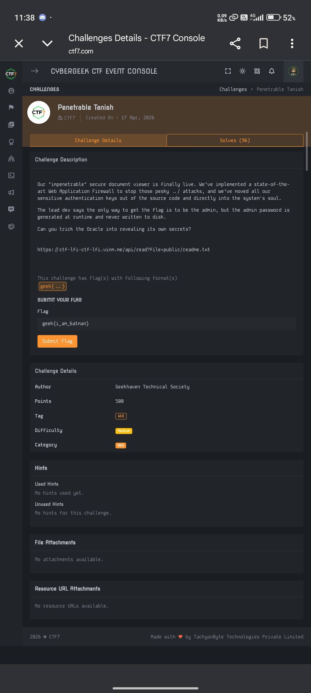
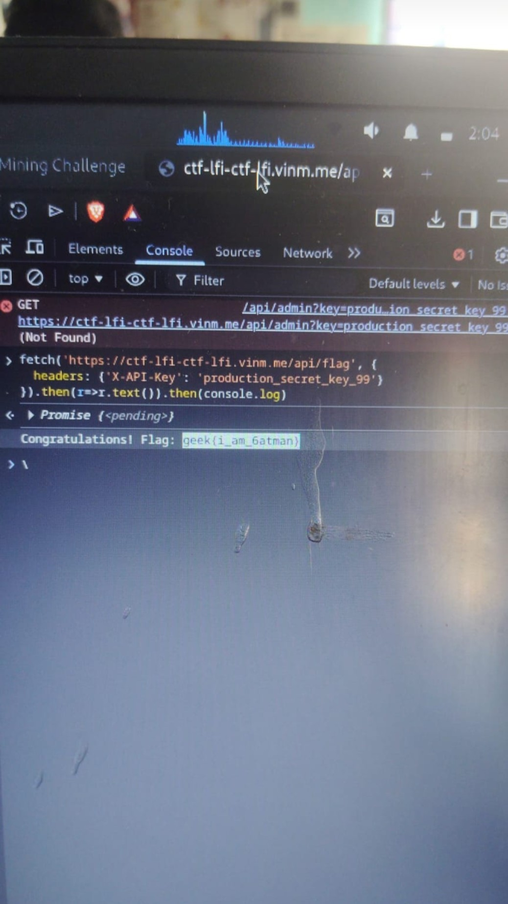
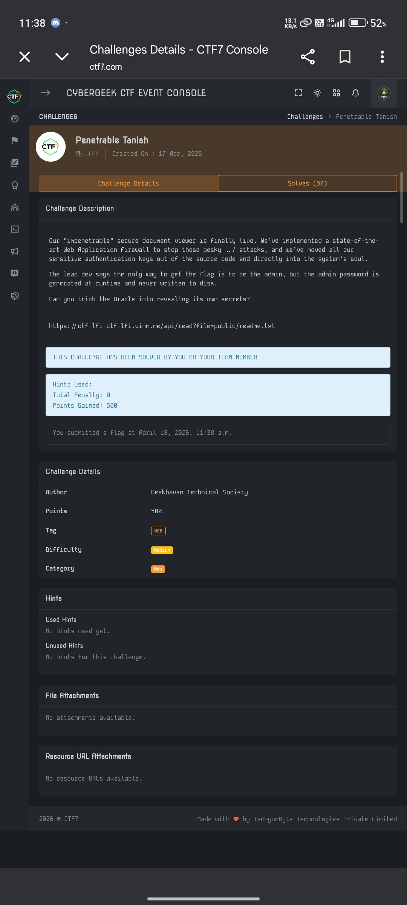
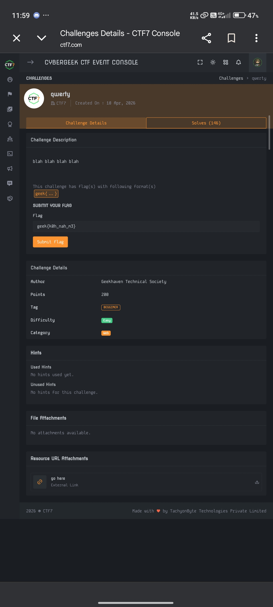
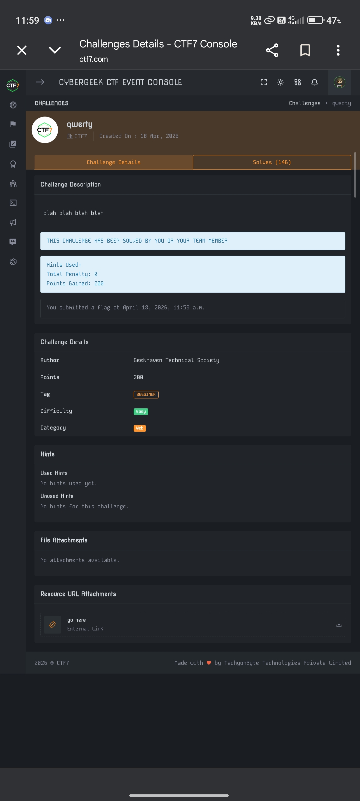
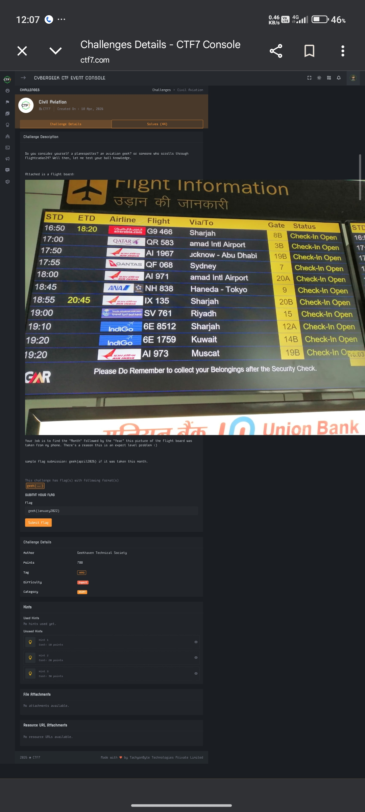
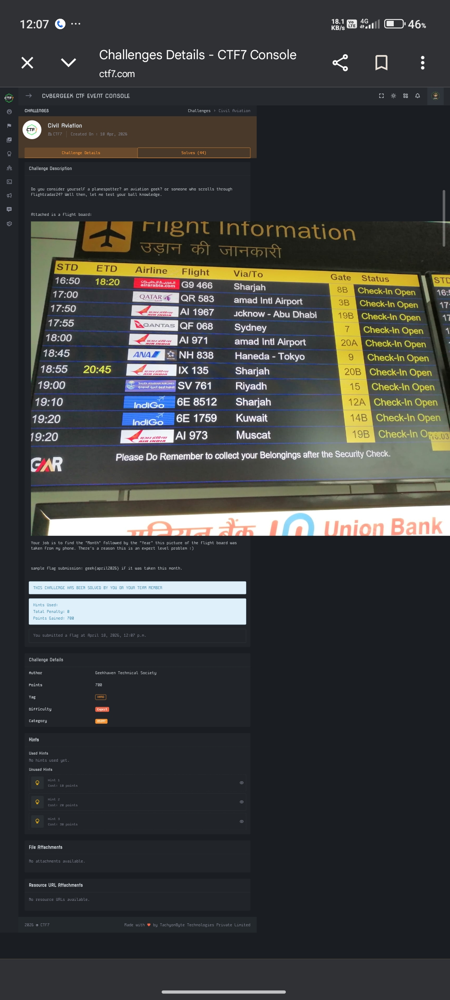
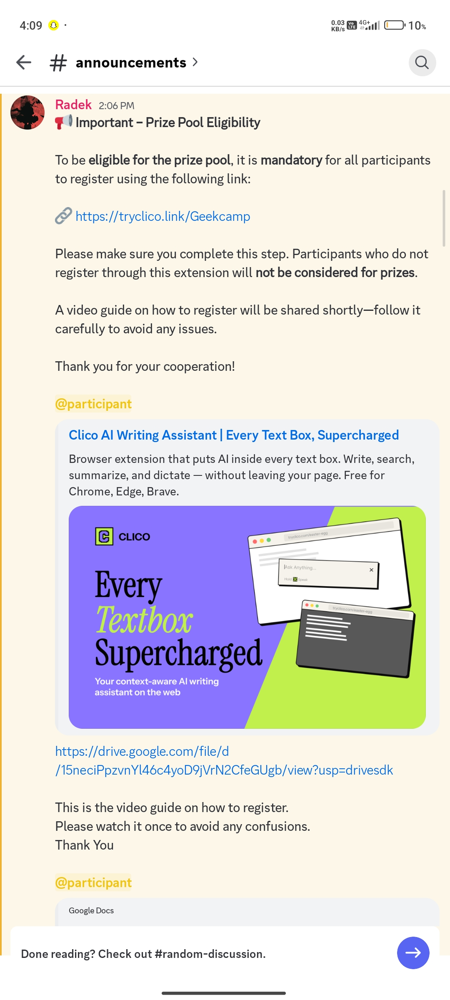
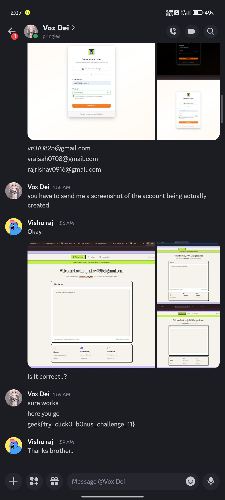
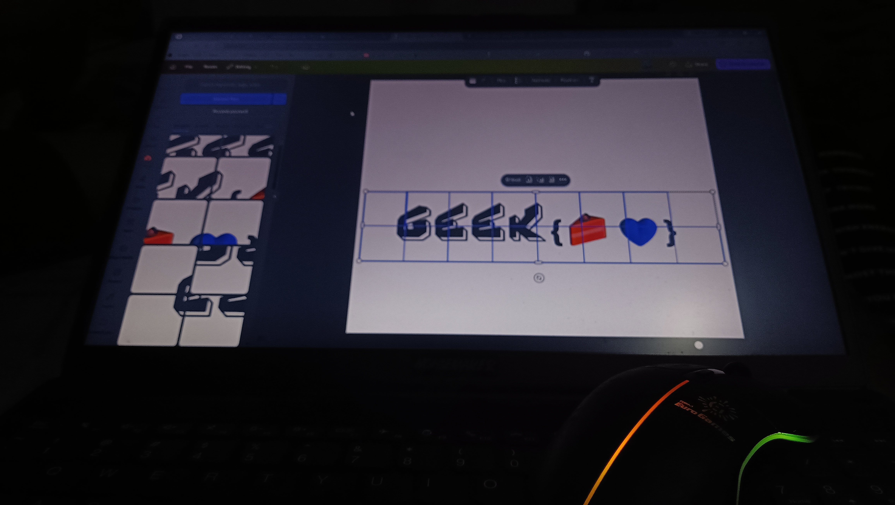

# 🚩 CYBERGEEK'26 CTF - Team Root@Kali Writeups

Welcome to the writeup repository for **Team Root@Kali** for the **CYBERGEEK'26 CTF**.

---

# 🏆 Team Overview

- **Team Name:** Root@Kali  
- **Team Members:** -
  - Rooted Kali (@rooted_kali)  
  - Rishav Raj (@Rishav_1609)  
  - Vishu Raj (@Vishu)  


- **Final Rank:** 65  
- **Score:** 7350 Points  
- **Flags Captured:** 19  


---

# 📌 Event Details

Cybergeek CTF is a high-octane, Jeopardy-style competition sponsored by **CTF7**, featuring challenges across:

- AI Security
- Web Exploitation
- Cryptography
- Reverse Engineering
- Pwn / Binary Exploitation
- Forensics
- OSINT


---

# 💻 Web Exploitation

## 🧠 Penetrable Tanish (500 pts)

### Description
> Our "impenetrable" secure document viewer is finally live. We've implemented a state-of-the-art Web Application Firewall to stop those pesky ../ attacks, and we've moved all our sensitive authentication keys out of the source code and directly into the system's soul. The lead dev says the only way to get the flag is to be the admin, but the admin password is generated at runtime and never written to disk. Can you trick the Oracle into revealing its own secrets?



### Challenge URL
```text
[https://ctf-lfi-ctf-lfi.vinm.me/api/read?file=public/readme.txt](https://ctf-lfi-ctf-lfi.vinm.me/api/read?file=public/readme.txt)

```

### Solution

While inspecting the application, an exposed admin endpoint leaked the following API key:

```text
production_secret_key_99

```

Using the leaked API key, a direct request was sent to the `/api/flag` endpoint through the browser console.

### Exploit

```javascript
fetch('[https://ctf-lfi-ctf-lfi.vinm.me/api/flag](https://ctf-lfi-ctf-lfi.vinm.me/api/flag)', {
    headers: {'X-API-Key': 'production_secret_key_99'}
}).then(r=>r.text()).then(console.log)

```



### Flag

```text
geek{i_am_6atman}

```



---

## 🧠 qwerty (200 pts)

### Description

> blah blah blah blah



### Flag

```text
geek{k0h_nah_m3}

```



---

# 🔍 Forensics

## 📡 Headers Whisper (300 pts)

### Description

> Our internal network monitors flagged an unusual spike in ICMP traffic between two developer workstations last night. While the packet volume was low, the timing was highly irregular. We've captured a snippet of the conversation in the attached PCAP (`capture_XTpM7L8.pcap`). On the surface, it's just a series of pings. But N-Corp doesn't pay its engineers to spend all night pinging each other. Look closer.


### Solution

The hint was hidden in the phrase **"irregular timing"**.

A custom Python script using `scapy` (`rdpcap`) calculated packet time differences. Interpreting those time deltas as ASCII values revealed the flag.

### Script

```python
from scapy.all import rdpcap

# Load packets
packets = rdpcap('capture_XTpM7L8.pcap')

flag = ""

# Calculate packet delta timings
for i in range(1, len(packets)):
    delta = packets[i].time - packets[i - 1].time
    ascii_val = int(round(delta))

    if 32 <= ascii_val <= 126:
        flag += chr(ascii_val)

print(flag)

```


### Flag

```text
geek{h34d3r_sh3n4n1g4ns_v14_1cmp}

```

---

## 🖼️ Do you like to write or append? (200 pts)

### Description

> You think it's special, but its all reused.


### File

```text
strawberry_ice_cream.jpg

```

### Solution

Using:

```bash
strings strawberry_ice_cream.jpg | grep "geek"

```

revealed fake flags inside XMP metadata tags.


However, examining the complete `strings` output and checking appended data beyond the EOF markers exposed the real flag.

### Flag

```text
geek{4pp3nd_1s_n0t_alw4ys_f4f4f4}

```

---

## ⏳ punnnnish (300 pts)

### Description

> Our investigators have recovered a Git repository from a suspect known as "The Timekeeper." On the surface, the repository contains nothing but a series of mundane updates to a single text file. However, a behavioral analyst noted that the suspect was obsessed with precision and rhythm.


### File

```text
punish.zip

```

### Flag

```text
geek{t1m3_tr4v3l_c0mm1t5}

```


---

## 🃏 Malice in Wonderland (500 pts)

### Description

> The artifact has a heart that beats only when it's told to. Good luck finding the pulse.


### File

```text
artifact.zip

```

### Flag

```text
geek{p0lygl0t_ch4n3l3on_m4st3r_2026}

```


---

## 📄 Peeedeeeeffffff (500 pts)

### Description

> pee dee ef


### File

```text
Archive_me_in_your_Heart.pdf

```

### Flag

```text
geek{I_l0ve_PDF}

```


---

## ⚰️ Six Feet Under (500 pts)

### Description

> Read the caption. You may take it literally. Find the flag.


### File

```text
i_love_this_show.jpeg

```

### Flag

```text
geek{six_feet_under_the_surface}

```

---

# 🌐 OSINT

## ✈️ Civil Aviation (700 pts)

### Description

> Do you consider yourself a planespotter? an aviation geek? or someone who scrolls through Flightradar24? Well then, let me test your ball knowledge.



### Sample Flag Format

```text
geek{april2026}

```

### Solution

The image contained flight information such as:

* Air Arabia G9 466 → Sharjah
* Qatar Airways QR 583 → Hamad Intl
* Air India AI 1967 → Lucknow - Abu Dhabi
* Qantas QF 068 → Sydney

Matching the schedules and flight routes helped determine the exact month and year.

### Flag

```text
geek{january2022}

```



---

# 🧩 Miscellaneous

## 🎁 tryClico bonus challenge (500 pts)

### Description

> Important - Registration & Bonus Challenge.




Participants had to:

1. Register through the provided link
2. Install the extension
3. Connect accounts
4. Send screenshots and email IDs to Discord

### Solution

Registered emails:

* vr070825@gmail.com
* vrajsah0708@gmail.com
* rajrishav0916@gmail.com

Captured dashboard screenshots and submitted them to Vox Dei.




### Flag

```text
geek{try_click0_b0nus_challenge_11}

```


---

## 💔 Sexy Srizzy eg pg (200 pts)

### Description

> "Broke my heart now keep arranging shards"


### File

```text
lol.zip

```

### Solution

The archive contained fragmented image pieces. Reassembling them revealed a graffiti-style emoji flag.



### Flag

```text
geek{🍰💙}

```

### Submitted Variant

```text
geek{🍞💜}

```

---

## 🧊 Sexy Srijjy (300 pts)

### Description

> What a flag is if not product of our routes?


### File

```text
cubeooter.zip

```

### Flag

```text
geek{216}

```

---

# 🔐 Cryptography

## 🧬 Galois' Genesis (500 pts)

### Description

> In every circle of life, there's always that one spark that keeps everyone moving. Good Luck!


### Cipher Text

```text
0eRbrk{_ng}eoe3Z|aEm1g

```

### File

```text
logo2.png

```

### Flag

```text
geek{Z0mb1E_g3neral0R}

```

---

# ⚙️ Reverse Engineering

## 🧩 The Last Fragment (500 pts)

### Description

> Node B4 left this behind. We don't know how it works, but it requires both the executor and the fragment to run.


### Goal

Find the input that results in:

```text
ACCESS GRANTED.
Access key accepted.

```

### File

```text
The_Fragment.zip

```

---

## 🎭 Lovable Sahil 2 (500 pts)

### Description

> Welcome to the funhouse. The walls are shifting, the locks change every cycle, and your debuggers are going to lie to you.


### File

```text
chall_aLyMUHu

```

---

# 📊 Solved Challenges Progress

Team **Root@Kali's** solved timeline across the CTF!


---

# ❤️ Team Root@Kali

```text
Rooted Kali | Rishav Raj | Vishu Raj

```

---
